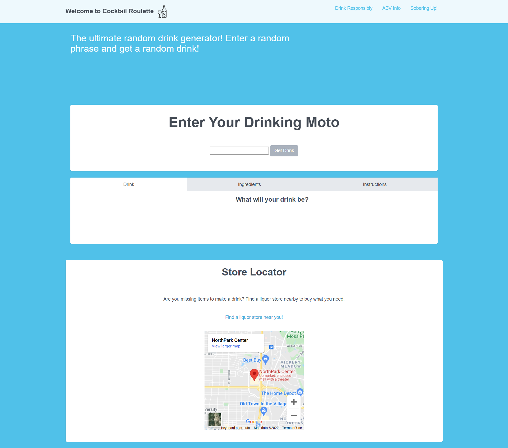

# Cocktail Roulette!

MVP and USER STORY:  
Audience- Thirsty people  
Problem Addressed- They aren't sure what cocktail to make  
Problem Solved By- Generating a random cocktail for them to try  

AS A: Thirsty person,
I WANT: A cocktail recipe generated for me,
SO THAT: I can mix tasty drinks at home for myself and friends

GIVEN: A random cocktail,
WHEN: I select a cocktail
THEN: I am given a list of ingredients and mixing instructions

GIVEN: A store locator,
WHEN: I click the "find store" link,
THEN: I am presented with a map of stores nearby 

  
  
  
## Built With
- HTML
- CSS
- JavaScript
  

## APIs Used
- Bootflat
- The Cocktail DB (on Rapid API)
- Google Maps Platform and Places API

## Wireframe

## Screen Capture

## Website
<https://father-of-cats.github.io/the-cocktail-roulette/>

## Contributions
- Elmer Reyes <https://github.com/Erey2790>
- Hunter Nelson <https://github.com/Father-of-Cats>
- Kevin Pena
- Jeremy O'Daniel <https://github.com/jeremyodaniel>