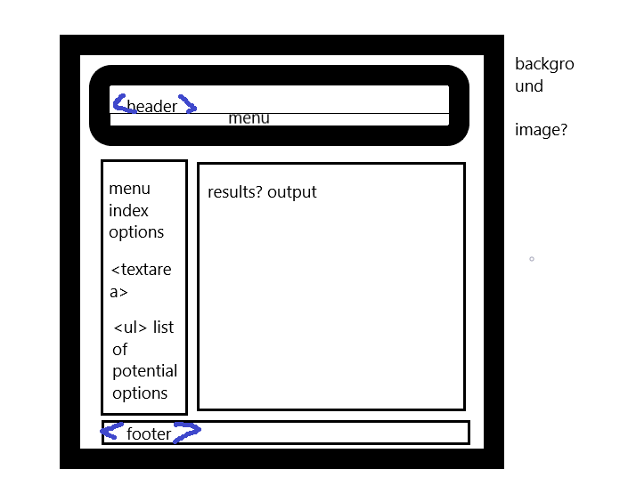

# the-cocktail-wizard

MVP and USER STORY

Audience- Thirsty people  
Problem Addressed- Don't know how to mix a drink 
Problem Solved By- creating list of cocktails with ingredients, measurements, and 
		        mixing instructions

AS A: Thirsty person,
I WANT: A list of cocktails I can make with items in my pantry,
SO THAT: I can mix tasty drinks at home for myself and friends.		   

GIVEN: a list of ingredients,
WHEN: i select an ingredient, it's added to a list called "pantry".
THEN: i am given a list of cocktails i can make from ingredients in pantry

GIVEN: a list of cocktails,
WHEN: i select a cocktail
THEN: i am given a list of ingredients and mixing instructions

GIVEN: a list of cocktails,
WHEN: i have a majority required of ingredients in my pantry,
THEN: i am shown a list of missing ingredients

GIVEN: a selected cocktail,
WHEN: a list of missing ingredients exists,
THEN: i am prompted to use a store locator

GIVEN: a store locator,
WHEN: i input my zip code,
THEN: i am presented with a map of stores within a set distance

## Wireframe

